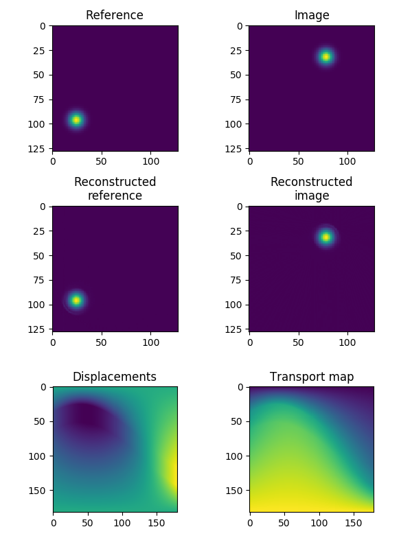

# Optimal Transport in Python

This package provides implementations for many optimal transport methods developed and published by the [Imaging and Data Science Lab](http://imagedatascience.com/), led by Prof. Gustavo K. Rohde.
It also provides implementations for many common methods found in the lab's papers, such as penalized linear discriminant analysis (PLDA).

The aim of this package is to make optimal transport transforms available to a wide range of researchers. If you're unsure how optimal transport methods can be useful in signal and image analysis problems, we recommend looking through the [teaching material from the ISBI 2018 conference tutorial](http://imagedatascience.com/transport/tutorials_isbi18.html) on optimal transport in biomedical imaging. For more information about the Imaging and Data Science Lab, as well as a list of publications, see the [lab website](http://imagedatascience.com/).


## Requirements

The following packages are required in order for the `optimaltransport` package to work correctly:

* Python 3.5+
* Numpy
* Scipy
* Scikit-learn
* matplotlib


## Installation

At present, the `optimaltransport` package cannot be installed via `pip`, `easy_install`, or Anaconda. Therefore, you will need to add the `optimaltransport` directory to your Python path. After that, you should be able to import modules, classes, and functions as normal.

```python
import sys
sys.path.append('path/to/optimaltransport')

from optrans.continuous import RadonCDT
```

## Package overview

The `optimaltransport` package comprises four modules:

* `continuous`: Continuous optimal transport transform methods. e.g. `CDT`, `VOT2D`.
* `decomposition`: Dimensionality reduction, classification, and correlation methods. e.g. `PLDA`, `CCA`
* `utils`: Utility functions. e.g. `signal_to_pdf()`, `interp2d()`
* `visualization`: Plotting functions. e.g. `plot_displacements2d()`


## Documentation and tutorials

In-depth tutorials explaining how to use optimal transport in signal and image analysis can be found in the *tutorials* directory. The *tests* directory contains examples of how to use the functions and classes in the `optimaltransport` package, and full documentation for each module can be found in *docs/_build/html/index.html*.


## Example transform

Whilst we recommend reading the *Transform Basics* tutorial in the *tutorials* directory, here is a quick example showing how to compute the Radon-CDT of an image `img1` with respect to a reference `img0`.

```python
import numpy as np
import matplotlib.pyplot as plt
from optrans.utils import signal_to_pdf
from optrans.continuous import RadonCDT

# Create a reference image that integrates to 1
img0 = np.zeros((128,128))
img0[96,24] = 1.
img0 = signal_to_pdf(img0, sigma=5., total=1.)

# Create an image that also integrates to 1
img1 = np.zeros((128,128))
img1[32,78] = 1.
img1 = signal_to_pdf(img1, sigma=5., total=1.)

# Compute the forward transform of img1 w.r.t. img0
radoncdt = RadonCDT()
rcdt = radoncdt.forward(img0, img1)

# Reconstruct the original images
img1_recon = radoncdt.inverse()
img0_recon = radoncdt.apply_forward_map(radoncdt.transport_map_, img1)

# Plot the results
fig, ax = plt.subplots(3, 2, figsize=(6,8))
ax[0,0].imshow(img0)
ax[0,0].set_title('Reference')
ax[0,1].imshow(img1)
ax[0,1].set_title('Image')
ax[1,0].imshow(img0_recon)
ax[1,0].set_title('Reconstructed\nreference')
ax[1,1].imshow(img1_recon)
ax[1,1].set_title('Reconstructed\nimage')
ax[2,0].imshow(radoncdt.displacements_)
ax[2,0].set_title('Displacements')
ax[2,1].imshow(radoncdt.transport_map_)
ax[2,1].set_title('Transport map')
fig.tight_layout()
plt.show()
```

This example code produces the following results:



It should be noted that the optimal transport transforms are written in such a manner that the user can interchange the methods with minimal hassle. For example, `RadonCDT` in the above example could be replaced with the single-potential optimal transport method `SPOT2D`.


## Acknowledgements

* Liam Cattell (primary author)
* Gustavo K. Rohde
* Soheil Kolouri
* Serim Park
